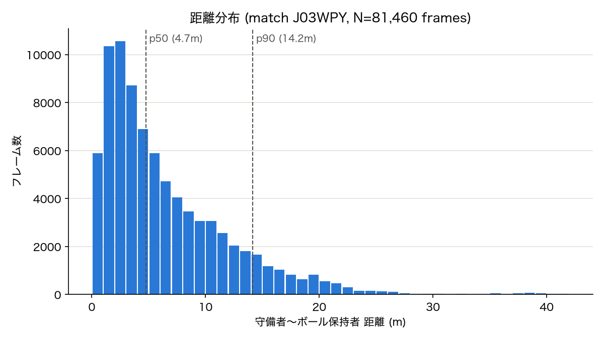

# 事前検証: 守備者〜ボール保持者間の距離レンジ

`research_plan.md` 5.1節で指摘した懸念、および実際の議論を踏まえた事前チェックの記録。

## 目的

3.3節の相互作用項

$$\vec{f}_{ij} = A_{ij}\exp\left(\frac{r_{ij}-d_{ij}}{B_{ij}}\right)\vec{n}_{ij}$$

において、$A_{ij}$と$B_{ij}$は距離$d_{ij}$がある狭いレンジにしか観測されない場合、互いにトレードオフして同じ力の値を再現できてしまう(非識別性)。この問題が実データで深刻かどうかを、本格的な推定パイプラインを組む前に安く確認する。

具体的には、力の大きさ $m = A\exp\left(\frac{r-d}{B}\right)$ の対数

$$\ln m = \ln A + \frac{r}{B} - \frac{d}{B}$$

は距離$d$に対して線形であり、$B$(傾き)と$A$(切片)を分離して復元するには、データ中で$d$が十分広いレンジにわたって変化している必要がある。そこでまず、実データにおいて守備者〜ボール保持者間の距離が実際にどれだけ広く分布しているかを確認した。

## 方法

- データ: idsse-data、match `J03WPY`(Fortuna Düsseldorf vs 1. FC Nürnberg, 2. Bundesliga)、kloppy経由でロード
- 対象フレーム: `ball_state == alive` かつ `ball_owning_team_id` が既知のフレーム(146,211フレーム中 81,460フレーム)
- **ボール保持者の定義(近似)**: トラッキングデータには個人単位の保持者フラグが存在しないため、`ball_owning_team_id`(チーム単位のフラグ)をもとに、保持チーム内でボールに最も近い選手を保持者として近似した。パスが飛んでいる最中などにノイズが混入し得るが、分布全体の傾向を覆すほどではないと考えている。正式なパイプライン(6.2節ステップ4)ではイベントデータとの紐付けに置き換える。
- 各フレームで、上記の近似的なボール保持者と、相手チームの最近傍選手との距離(2D, ピッチ座標をメートル換算)を計算
- 実装: `scripts/check_distance_range.py`

## 結果

| 指標 | 値 |
|---|---|
| p1 | 0.47 m |
| p5 | 0.82 m |
| p10 | 1.22 m |
| p25 | 2.38 m |
| **p50(中央値)** | **4.75 m** |
| p75 | 9.17 m |
| **p90** | **14.16 m** |
| p95 | 17.61 m |
| p99 | 24.19 m |
| min | 0.13 m |
| max | 41.99 m |
| mean ± std | 6.48 ± 5.57 m |

距離帯ごとの割合:

| 距離帯 | 割合 |
|---|---|
| < 2m | 19.9% |
| < 3m | 32.9% |
| < 5m | 52.0% |
| < 8m | 70.0% |
| < 10m | 78.1% |

## 解釈

- 距離は0.13m〜42mまで、対数スケールで約2桁にわたって連続的に分布しており、密着マークからビルドアップ中の遠い局面まで幅広くカバーされている。**単純な距離のばらつきという観点では、$A, B$の分離推定に必要な情報はデータ中に存在すると考えられる。**
- ただし、これは「1対1のペアワイズな距離レンジ」のみを見た結果である。モデルの相互作用項は $\sum_{j \in Opp(i)} \vec{f}_{ij}$ と**全守備者からの力の総和**であり、観測できるのは加速度への総和の寄与のみである。複数の守備者が同時に、どんな距離配置で迫っているかの多様性(多選手の重ね合わせによる非識別性)は、このチェックでは確認できていない。

## 未解決・次のアクション

- [ ] 多選手の重ね合わせによる非識別性の確認: SFMのODEから既知の$A, B, \tau$で合成軌道を生成し、(B)の軌道ベース最適化でパラメータを復元できるか検証する(この距離分布に似せたシナリオで実施)
- [ ] ボール保持者の定義をイベントデータとの紐付けに置き換えた場合に、この分布がどの程度変わるかの確認(6.2節ステップ4)
- [ ] 他の試合(7試合中の残り6試合)でも同様の傾向が見られるかの確認(1試合だけでは一般化できない)

## 関連ファイル

- `scripts/check_distance_range.py` — 距離レンジ集計スクリプト
- `scripts/distance_range_result.json` — 集計結果(生データ)
- `scripts/plot_distance_range.py` — ヒストグラム画像生成スクリプト
- `documents/figures/defender_distance_range.png` — 本ドキュメントに埋め込んだ画像
