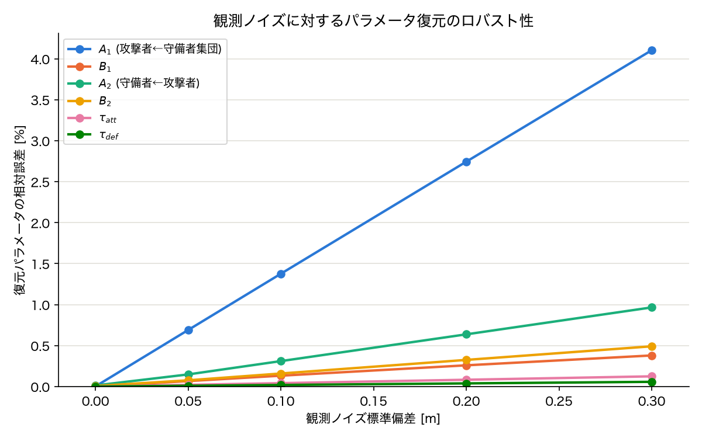

# 事前検証: 観測ノイズに対するパラメータ復元のロバスト性

`synthetic_recovery_test.md` の続きとして、実データに存在するトラッキングノイズを想定した頑健性チェックの記録。

## 目的

`synthetic_recovery_test.md` ではノイズなしの理想条件でパラメータを完全に復元できることを確認した。しかし実際のトラッキングデータには観測ノイズが乗る。research_plan.md 5.1節が(A)局所回帰ではなく(B)軌道ベース最適化を主結果に選んだ理由は「位置データの2階微分によるノイズ増幅を受けない」ことだったが、これが実際に成り立つかを合成データで確認する。

## 方法

`synthetic_recovery_test.py` の生成過程はそのままに、観測軌道に対して各フレーム独立のガウスノイズ($\sigma$ = 0, 0.05, 0.1, 0.2, 0.3 m)を加えたものを最適化のターゲットとして使用した(`scripts/noise_robustness_test.py`)。光学トラッキング(TRACAB等)の一般的な精度はサブ0.1m程度とされるため、$\sigma=0.3$mはかなり悲観的な水準を含む。真のパラメータ・初期値・エピソード構成は前回と同一。

## 結果

| ノイズ$\sigma$ [m] | $A_1$ | $B_1$ | $A_2$ | $B_2$ | $\tau_{att}$ | $\tau_{def}$ |
|---|---|---|---|---|---|---|
| 0.00 | +3.000 | +4.000 | −3.999 | +6.000 | +0.500 | +1.000 |
| 0.05 | +3.021 | +3.997 | −4.006 | +5.995 | +0.500 | +1.000 |
| 0.10 | +3.041 | +3.995 | −4.012 | +5.990 | +0.500 | +1.000 |
| 0.20 | +3.082 | +3.990 | −4.026 | +5.980 | +0.500 | +1.000 |
| 0.30 | +3.123 | +3.985 | −4.039 | +5.971 | +0.499 | +1.001 |

(真値: $A_1$=+3.000, $B_1$=+4.000, $A_2$=−4.000, $B_2$=+6.000, $\tau_{att}$=0.500, $\tau_{def}$=1.000)

最大ノイズ($\sigma=0.3$m)でも相対誤差は $A_1$ で4.1%、他は1%未満に収まった。符号はすべてのノイズレベルで正しく復元されている。

## 解釈

- 相対誤差はノイズレベルに対してほぼ線形に増加しており、ノイズが破滅的に増幅される様子は見られない。**(A)局所回帰(2階微分)であればノイズが大きく増幅されるところ、(B)軌道ベース最適化ではノイズへの感度が緩やかに保たれている**ことが確認でき、5.1節の設計判断を支持する結果。
- $\tau_{att}, \tau_{def}$(緩和時間)はノイズにほぼ影響を受けていない。駆動力の関数形が相互作用項と異なるため、ノイズが乗ってもこの2つは分離して安定に推定できると考えられる。
- $A_1$(攻撃者が守備者集団から受ける力)が他パラメータより誤差の伸びが大きい。これは「複数守備者からの力の総和」という重ね合わせの影響を最も受けやすいパラメータであるためと考えられ、`synthetic_recovery_test.md`で触れた重ね合わせの非識別性が、ノイズ下では相対的に顕在化しやすい方向として現れている可能性がある。実データでの本推定時は、このパラメータの信頼区間・感度分析を優先的に見る価値がある。

## 未解決・次のアクション

- [ ] 今回のノイズ設定は各フレーム独立(i.i.d.)なガウスノイズであり、実際のトラッキングノイズが持ちうる時間相関(平滑化フィルタ処理後の残差など)は考慮していない。より現実的なノイズモデルでの追試は今後の課題。
- [ ] ステップ1(主結果)としては、この結果をもって「(B)によるノイズ耐性」を裏付けとし、実データパイプライン構築(フェーズ1)に進んで問題ないと判断する。

## 関連ファイル

- `scripts/synthetic_recovery_test.py` — `run_experiment()` としてノイズ付き実験に対応するようリファクタリング済み
- `scripts/noise_robustness_test.py` — 複数ノイズレベルでの実行スクリプト
- `scripts/noise_robustness_result.json` — 実行結果(生データ)
- `scripts/plot_noise_robustness.py` — 図の生成スクリプト
- `documents/figures/noise_robustness.png` — 本ドキュメントに埋め込んだ画像
