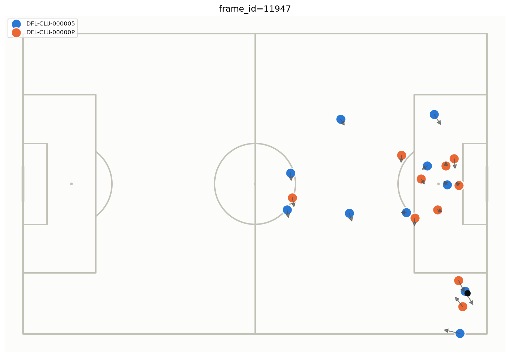
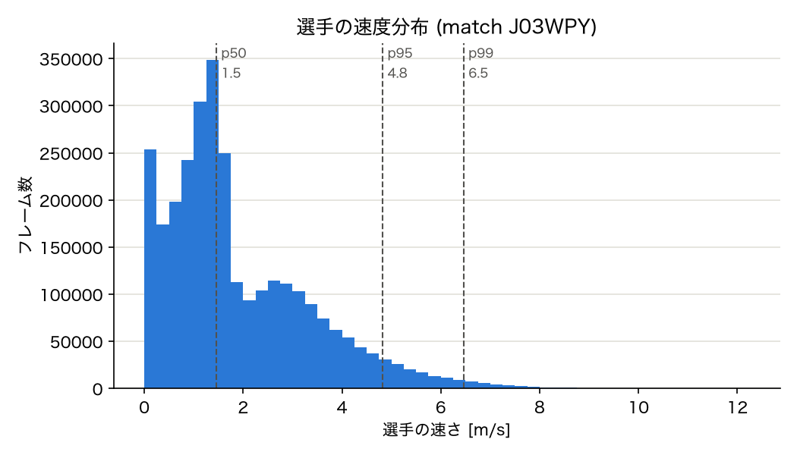
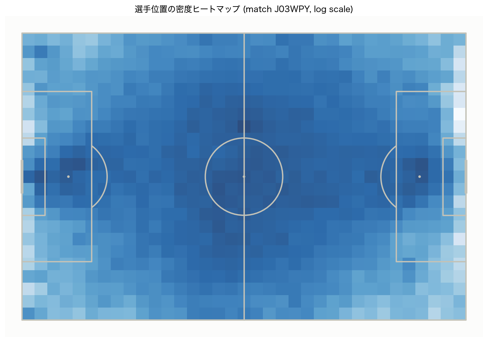
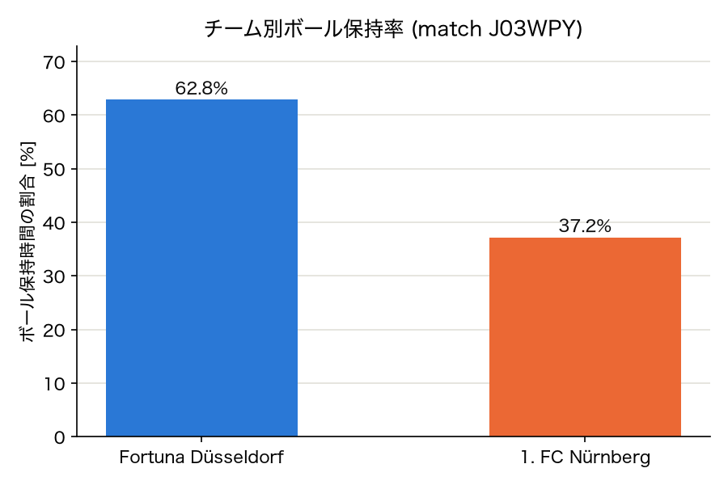
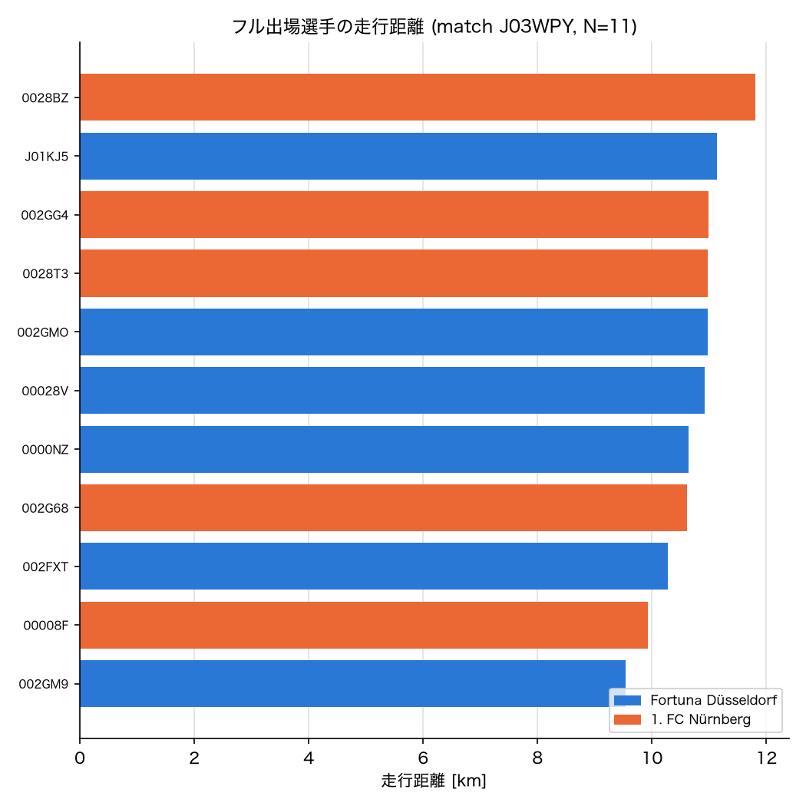

# フェーズ1: データパイプライン構築(1試合分)

research_plan.md 6.3節「フェーズ1: データパイプライン構築・可視化」の実装記録。事前検証(`check_distance_range.md`, `synthetic_recovery_test.md`, `noise_robustness_test.md`)を経て「行けそう」と判断した後の、最初の本実装。

## スコープ

6.2節の前処理ステップのうち、今回実装したのは以下:

- ステップ1: フレームごとに全選手+ボールをスナップショット形式に整形
- ステップ2: GKの除外
- ステップ3: 速度・加速度の算出(有限差分 + Savitzky-Golay平滑化)
- ステップ7: 前処理済みデータの`.parquet`キャッシュ保存

以下は7試合分のデータを本格的に扱う段階に回し、今回は対象外:

- ステップ4: イベントデータとの紐付けによる正式なボール保持者特定(`check_distance_range.md`では距離ヒューリスティックによる簡易版のみ実施済み)
- ステップ5: トランジション局面の扱い
- ステップ6: train/valid/test分割

## 実装

`sfm_press/` パッケージとして再利用可能な形で実装(`scripts/`はこれまで通り使い捨ての検証用に維持)。

- `sfm_press/data.py`
  - `build_snapshot(match_id) -> pd.DataFrame`: kloppyで試合をロードし、ロング形式(1行 = 1フレーム×1エンティティ)のスナップショットに整形して`.parquet`にキャッシュ
  - GK判定: kloppyの`Player.starting_position == "Goalkeeper"`で判定・除外
  - 座標は正規化値([0,1])からメートルに変換(ピッチ 105m×68m)
  - 速度・加速度: `scipy.signal.savgol_filter`(window=9フレーム=0.36秒, polyorder=3)で位置を平滑化しつつ微分。交代選手の非出場区間などの欠損は、5フレーム以内の短い欠損のみ線形補間し、それ以上の欠損・その近傍(window//2フレーム以内)はNaNとして伝播させる(不正確な推定値を出さないため)
- `sfm_press/viz.py`
  - `plot_frame(snapshot, frame_id)`: mplsoccerで1フレームの選手配置・速度ベクトルを描画するデバッグツール

## 結果

対象試合: `J03WPY`(Fortuna Düsseldorf vs 1. FC Nürnberg)

| 項目 | 値 |
|---|---|
| 総フレーム数 | 146,211(前半69,131 + 後半77,080、25Hz) |
| エンティティ数 | 30(ボール1 + 選手29) |
| そのうちフル出場(欠損0%) | 20人 |
| 交代出場選手(部分欠損あり) | 9人 |
| 出力行数 | 4,386,330(ロング形式) |
| 初回ビルド時間 | 約46秒 |
| キャッシュ読込時間 | 約0.8秒 |
| キャッシュサイズ | 約130MB(.parquet、gitignore対象) |

エンティティ数が22ではなく30である点は、両チームの登録メンバー(20人ずつ、GK込み)のうち交代出場した選手も含まれるためで、想定通りの挙動。フル出場20人は欠損0%、交代選手は出場していない区間がNaNとして正しく表現されている。

### サンプルフレームの可視化

ゴール前に選手が密集し、速度ベクトルも自然な向きを示しており、座標変換・チーム分け・速度算出が正しく機能していることを確認できる。

## 基本統計量の可視化

前処理済みスナップショットが妥当かを確認するため、基本的な統計量を可視化した(`scripts/basic_stats.py`)。対象は同じく`J03WPY`。

### 選手の速度分布

中央値1.5m/s、p95で4.8m/s、p99で6.5m/s。エリート選手のスプリント速度として現実的な範囲に収まっており、Savitzky-Golay平滑化による速度算出が破綻していないことを確認できる。

### 選手位置の密度ヒートマップ

中央エリアの密度が最も高く、ペナルティエリア内はやや低いという典型的な傾向が出ている。座標変換(正規化値→メートル)とピッチ寸法(105m×68m)の整合性が取れていることの確認にもなる。

### チーム別ボール保持率

Fortuna Düsseldorf 62.8% / 1. FC Nürnberg 37.2%。`ball_owning_team_id`(チーム単位のフラグ)の集計であり、`check_distance_range.md`で使った近似的なボール保持者特定とは別の、より信頼性の高い値。

### フル出場選手の走行距離ランキング

フル出場した11人(交代の影響で両チーム合わせて11人という結果)の走行距離は9.5〜12km。プロサッカー選手の1試合の走行距離として一般的に報告される範囲(10〜12km程度)と整合しており、速度の時間積分が妥当であることの追加的な確認になる。

## 次のアクション

- [ ] 残り6試合分のキャッシュ生成(Colab運用フロー整備前にローカルで動作確認だけ済ませておく)
- [ ] イベントデータとの紐付けによるボール保持者特定(6.2節ステップ4)。`check_distance_range.md`のヒューリスティック版との比較検証
- [ ] トランジション局面の扱い方針の決定(6.2節ステップ5)
- [ ] train/valid/test分割の実装(6.2節ステップ6、試合単位)
- [ ] フェーズ2(5.2節、(B)軌道ベース最適化)へ、この`build_snapshot()`の出力をそのまま接続する

## 関連ファイル

- `sfm_press/data.py`, `sfm_press/viz.py` — パイプライン本体
- `data/cache/*.parquet` — キャッシュ(gitignore対象、リポジトリには含まれない)
- `scripts/basic_stats.py` — 基本統計量の集計・可視化スクリプト
- `scripts/basic_stats_result.json` — 集計結果(生データ)
- `documents/figures/sample_frame.png`, `documents/figures/basic_*.png` — 本ドキュメントに埋め込んだ画像
