# 実データでの(B)軌道ベース最適化 スモークテスト

`phase1_data_pipeline.md`で構築したパイプラインを使い、実際のプレッシャー局面に対して(B)の軌道ベース最適化(5.2節)を初めて適用した記録。フェーズ2(実データ検証)の先取りとして、「行けそう」判定の最後に残っていた課題(SFMが実際の守備行動をどれだけ説明できるか)への最初の一歩。

## 目的

これまでの検証(`synthetic_recovery_test.md`, `noise_robustness_test.md`)はすべて「モデルが正しいと仮定した場合」の理想条件だった。実データでは:

- モデルの定式化が現実の選手行動とどれだけ一致するか(モデルの妥当性)
- 各選手の「意図した速度」$v_0 e_i(t)$(3.2節)をどう定義するか(研究計画10節で未確定の項目)

という、合成データでは検証できない問題が新たに生じる。今回はこれを実際に試すスモークテストとして位置づける。

## 方法

**対象区間の選定**: `check_distance_range.md`と同じボール保持者ヒューリスティック(保持チーム内でボールに最も近い選手)を使い、同一選手が保持し続ける連続区間(run)の中から、最近傍の守備者が最も距離を詰めてきている区間を選択した。

- 試合: `J03WPY`、対象区間: 343フレーム(13.7秒)
- 攻撃者(ボール保持者)1人 + 守備者3人(攻撃者との平均距離が近い順)
- 最近傍守備者は区間中に5.7m→0.8mまで接近(明確なプレッシャー局面)

**モデル構成**: `synthetic_recovery_test.py`と同じ最小構成(攻撃者⇄守備者集団、$A_1,B_1,A_2,B_2,\tau_{att},\tau_{def}$の6パラメータ)を実データに適用。

**「意図した速度」$v_0 e_i(t)$の近似**: 各選手の観測軌道を**2秒窓**のSavitzky-Golay平滑化にかけて微分したものを、駆動力の目標(既知の入力)として使用した。3.2節の$e_i(t)$(ボール方向・目標スペースなど)の具体的な定義はまだ研究計画で確定していないため、今回は簡易的にこの自己参照的な平滑化で代用した。

**比較対象(ベースライン)**: $A_1=A_2=0$(相互作用なし)、$\tau=0.5$秒(歩行者分野で典型とされる値)に固定し、駆動力(意図した速度への追従)のみで軌道を再現した場合の誤差と比較。

## 結果

### 軌道の再現度

| | Trajectory MSE | RMSE |
|---|---|---|
| ベースライン(相互作用なし) | 3.29 m² | 1.81 m |
| フィッティング後 | 0.05 m² | **0.22 m** |
| 改善率 | | **98.5%** |

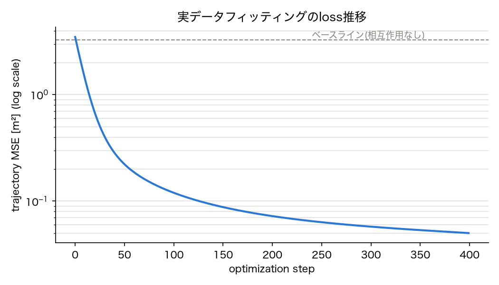

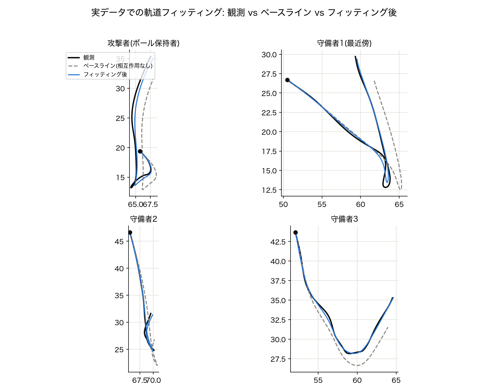

観測軌道(黒)に対して、ベースライン(灰色破線)は鋭いターンの局面(攻撃者・守備者1の切り返し)でコーナーを丸めてしまっているのに対し、フィッティング後(青)はそれらをよく再現できている。

### パラメータの収束: τ(緩和時間)の異常な縮退

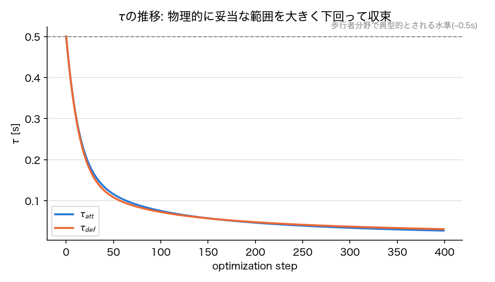

$\tau_{att}, \tau_{def}$は初期値0.5秒から単調に減少し続け、400ステップ終了時点で**約0.03秒**まで下がった(まだ収束しておらず、さらに下がる途中だった可能性が高い)。歩行者分野で物理的に妥当とされる$\tau \sim 0.5$秒を1桁以上下回っており、解釈可能な値とは言えない。

## 解釈: なぜτが縮退したのか

**軌道再現の見た目の良さ(98.5%改善)を額面通り「SFMが守備プレッシャーをよく説明した」結果として受け取るのは早計。** 以下のメカニズムでの「近道」が起きている可能性が高い。

1. 2秒窓の平滑化は一種のローパスフィルタであり、実際の選手の切り返し(0.2〜0.5秒スケール)より遅い信号しか作れない。そのため「意図した速度」は、実際の鋭いターンをなだらかに丸めた形でしか表現できていない。
2. これは実際にベースライン(τ=0.5秒で固定)の軌道が、鋭いターンでコーナーを丸めてしまっている(=図で確認済み)ことに現れている。
3. 駆動力の式 $\frac{v_0 e(t) - v}{\tau}$ において、$\tau$を極端に小さくすると速度は「意図した速度」にほぼ瞬時にスナップする。つまり$\tau \to 0$の極限では、シミュレーション軌道は「入力として与えた(平滑化済みの)観測軌道そのもの」をほぼ再生するだけになる。
4. これは相互作用項$A, B$が守備プレッシャーという物理を正しく捉えたからではなく、**駆動力側が答え(観測軌道を少しぼかしたもの)をほぼそのまま出力するように$\tau$が歪められた**ことによる。$A, B$の値は、この近道では説明しきれない残差を埋め合わせているに過ぎない可能性が高く、$A_1, A_2$の符号・大きさをそのまま解釈するのは危険。

## 追試: τに制約を加えるとどうなるか

上記の診断が正しいかを確認するため、同じ区間・同じ$v_0 e_i(t)$信号のまま、$\tau$をsigmoidで$[0.3, 1.2]$秒の物理的に妥当な範囲にハード制約して再フィッティングした(`scripts/real_data_fit_tau_constrained.py`)。

### 結果

| | Trajectory MSE | RMSE | ベースラインからの改善率 |
|---|---|---|---|
| ベースライン(相互作用なし) | 3.29 m² | 1.81 m | — |
| τ制約なし(前節) | 0.05 m² | 0.22 m | 98.5% |
| **τ制約あり** | 0.71 m² | **0.84 m** | **78.5%** |

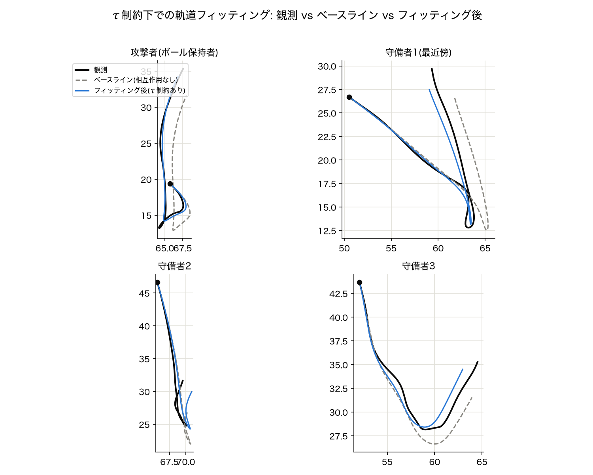

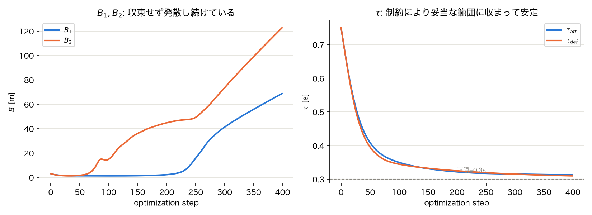

$\tau_{att}, \tau_{def}$は制約により0.31秒付近で安定した(想定通り)。**しかしその代わりに、$B_1, B_2$(相互作用の到達距離)が400ステップ終了時点でそれぞれ68.7m, 122.7mまで発散し、収束の兆しなく増加し続けている。** $A_1, A_2$は−0.53, +0.92でほぼ安定した。

### 解釈: 別の「逃げ道」に切り替わっただけ

$B$が非常に大きい極限では、$\exp\left(\frac{r-d}{B}\right) \to \exp(0) = 1$ となり、距離に依存しないほぼ**一定の力**に近づく。つまり$B$の発散は、τを塞いだ結果、最適化が「距離に応じて減衰する社会力」ではなく「ほぼ一定のオフセット力」で残差を埋め合わせる、**別の非物理的な近道**に切り替えただけだと考えられる。

$A_1, A_2$は安定して見えるが、$B$が発散し続けている状態でのその値を「解釈可能なパラメータ」として信頼するのは時期尚早である。フィット精度自体もτ制約なしの場合より明確に悪化しており(RMSE 0.22m→0.84m)、τの縮退がフィット精度に大きく貢献していたことも裏付けられた。

### この追試から得られた教訓

**1つの区間(343フレーム)・6パラメータという構成は、パラメータ数に対してデータの制約が弱く、根本的に劣決定(underdetermined)である可能性が高い。** ある自由度(τ)を塞ぐと、最適化は別の自由度(B)を使って同じように過学習する。これは対症療法(個々のパラメータに制約を追加していく)では根本解決にならないことを示唆しており、`synthetic_recovery_test.md`で20エピソード同時推定がうまく機能した理由(=多様な状況が同じパラメータを共有することで、特定の状況だけに都合の良い縮退を起こしにくくなる)を踏まえると、**複数区間でのプール推定が、対症療法より優先度の高い根本的な対策**だと考えられる。

## 追試2: 複数局面(12件)のプール推定

対症療法(τ制約のみ)では別の自由度(B)に逃げ道が移っただけだったことを受け、`check_distance_range.md`で最も深刻と見ていた懸念(多選手の重ね合わせによる非識別性)への本命の対策として、複数のプレッシャー局面をプールして同時推定した(`scripts/real_data_pooled_fit.py`)。

**方法**: 同一試合(J03WPY)内から、ボール保持者が変わらず続く区間のうち、最近傍守備者が最も距離を詰めてきている上位12局面を自動選定(各6秒=150フレームに統一)。τの範囲制約$[0.3, 1.2]$秒は維持しつつ、**Bには制約を加えず**、「プールすること自体」の効果を切り分けて確認した。1200ステップまで最適化。

### 結果

| | Trajectory MSE | RMSE | ベースラインからの改善率 |
|---|---|---|---|
| ベースライン(相互作用なし) | 1.51 m² | 1.23 m | — |
| プール推定(12局面) | 0.63 m² | **0.79 m** | **58.4%** |

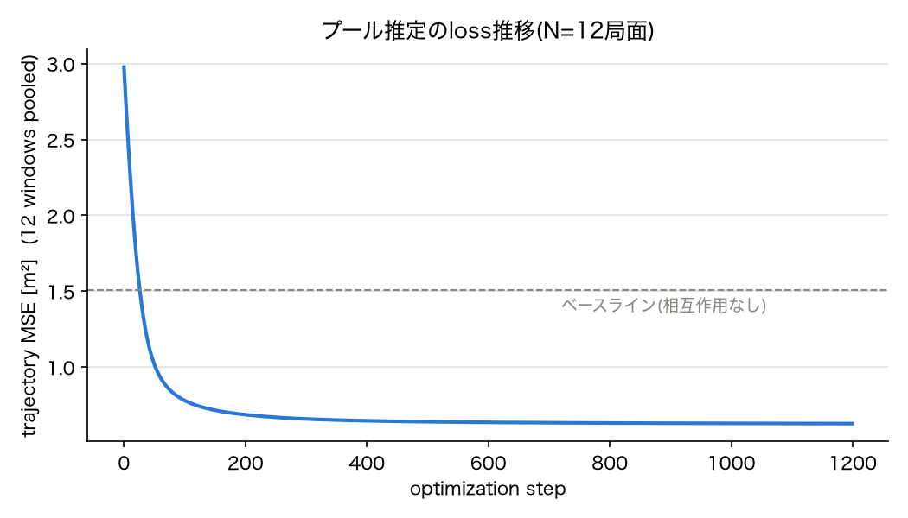

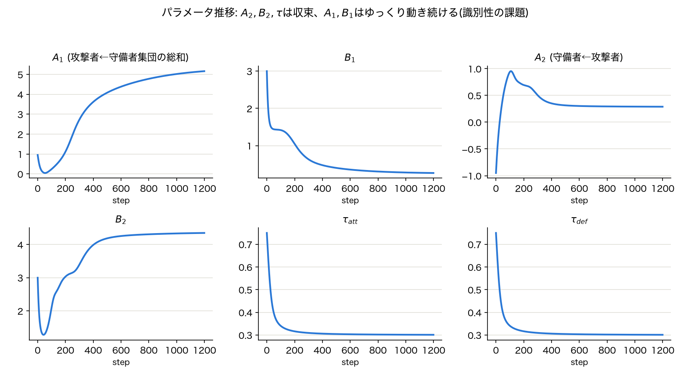

**$A_2, B_2, \tau_{att}, \tau_{def}$は明確に収束した**(1200ステップ時点でほぼ横ばい: $\tau \approx 0.30$秒、$B_2 \approx 4.35$m、$A_2 \approx +0.29$)。$B_2 \approx 4.35$mは`check_distance_range.md`で確認した実データの距離分布の中央値(4.75m)に近く、整合的な値と言える。

**一方、$A_1, B_1$(攻撃者が守備者集団から受ける力の総和)は1200ステップ経っても収束せず、$A_1$は増加・$B_1$は減少をゆっくり続けている。** ただし増加/減少の速度自体は着実に減衰しており(単一局面での追試で見られた加速度的な発散とは性質が異なる)、非常にゆっくりとした収束途上か、あるいは損失をほぼ変えずに$A_1$と$B_1$が反対方向に動ける「尾根(ridge)」上を漂っている状態と考えられる。

### 解釈

1. **プールは「対症療法では効かなかった発散」を解消した**: 単一局面の追試で見られたBの加速度的な発散(122mまで発散し続けていた)は、12局面プールでは起きていない。局面を増やしてパラメータを共有させるという方針は、少なくとも部分的には機能している。
2. **ただし、$A_1, B_1$には依然として識別性の課題が残っている。** これは`check_distance_range.md`で事前に指摘していた「多選手の重ね合わせ($\sum_j f_{ij}$)による非識別性」が、まさに$A_1$(攻撃者が**複数**守備者から受ける総和の力)に現れているという点で一貫している。対して$A_2, B_2$(守備者1人が攻撃者から受ける、総和を伴わない1対1の力)がきれいに収束したことは、「単選手間の相互作用は識別できるが、複数選手の重ね合わせは識別が難しい」という仮説を裏付ける結果と言える。
3. **$A_2$の符号は正(+0.29)に収束した。** これは3.3節・4.1節で想定していた「守備者は攻撃者に対して引力的(負)」という仮説とは逆の符号である。ただし、今回のモデルでは駆動力の目標(意図した速度)自体が実軌道の平滑化から作られており、守備者の「詰めていく」という大きな動き自体は既に駆動力側に吸収されている可能性が高い。その上で相互作用項が正(斥力的)に効くというのは、「詰めた後、間合いを詰めすぎない・軽く距離を保つ(いわゆるジョッキーイング)」という、より繊細な守備行動を捉えている可能性がある。これは推測の域を出ないため、断定はできない。

## 追試3: 駆動力を外部情報ベースに置き換える

これまでの実験はすべて、駆動力の目標$v_0 e_i(t)$を「選手自身の観測軌道の平滑化」という自己参照的な信号から作っていた。これはリーク(答えをほぼそのまま出力できる近道)の懸念があるため、選手自身の軌道を一切使わない外部情報ベースの設計に置き換えて再実験した(`scripts/real_data_pooled_fit_v2.py`)。

**新しい設計**:
- **攻撃者**: $e_i(t)$ = 相手ゴール方向(シミュレーション中の現在位置から動的に計算。GKの平均位置から攻撃方向を判定する`determine_attacking_goal_x()`を新規実装)、$v_0$ = 4.0 m/s固定
- **守備者**: $v_0=0$(意図した速度なし、純粋な減衰のみ)。実際の動き(チェイス含む)をすべて相互作用項$A_2$に帰属させる、最も保守的な設計

同じ12局面・τ制約$[0.3, 1.2]$秒を維持し、1200ステップ最適化。

### 結果: フィット精度が大きく悪化し、パラメータも収束しなかった

| | Trajectory MSE | RMSE | 改善率 |
|---|---|---|---|
| ベースライン(相互作用なし) | 72.3 m² | **8.50 m** | — |
| フィッティング後 | 29.4 m² | **5.42 m** | 59.3% |

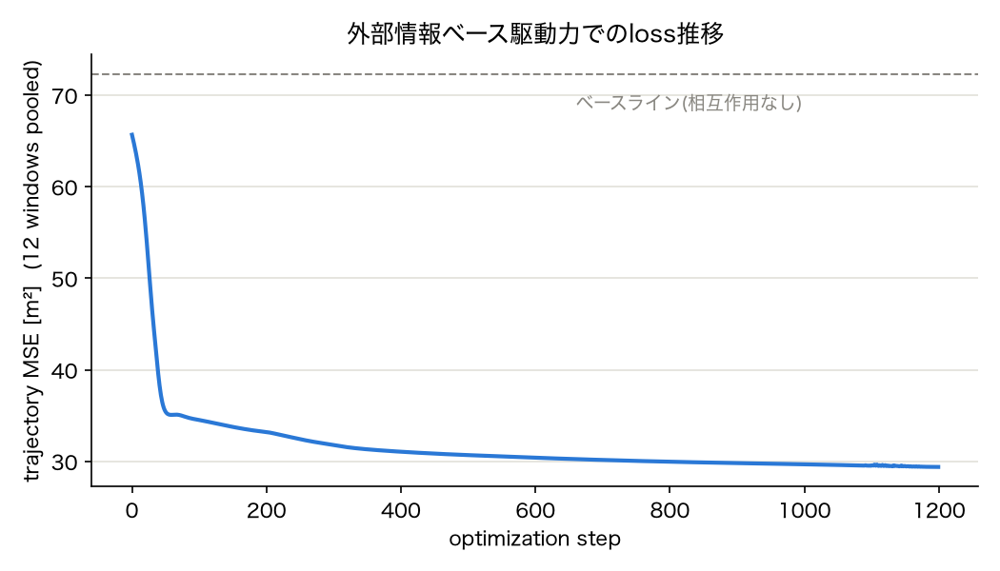

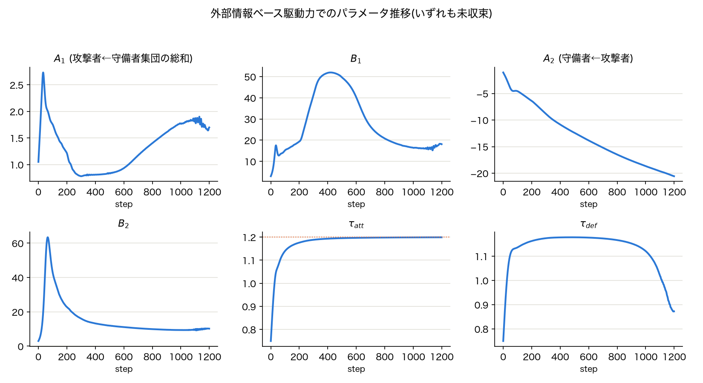

自己参照版のプール推定(RMSE 0.79m)と比べ、ベースライン・フィッティング後とも誤差が桁違いに大きい(RMSE 8.5m, 5.4m)。改善率(59.3%)自体は自己参照版(58.4%)と近い値だが、絶対誤差の水準がまったく違う。

パラメータも軒並み未収束:
- $\tau_{att}$は上限(1.2秒)に張り付いた。これは「駆動力の目標をできるだけ無視したい(＝相互作用項だけで軌道を説明したい)」という最適化の意図を示唆しており、**固定速度でゴールへ直進するという駆動力の仮定が、実際の選手の動きへの近似として悪すぎる**ことを意味する。
- $\tau_{def}$は上限付近まで上がった後、1000ステップ以降で急に下がり始めており、不安定。
- $A_1, B_1$は増加→減少→再増加という非単調な挙動で、明らかに収束していない。
- $A_2$は−20を超えてなお線形に増加し続けている(発散)。

### 解釈: 「クリーンな設計」は必ずしも「良いフィット」を意味しない

この結果は、リークの懸念を取り除いたこと自体は正しい判断だったが、**代わりに採用した駆動力の近似(一定速度でゴールへ直進、守備者は意図なし)が、実際の選手の動きに対してあまりに単純化しすぎている**ことを露呈させた。自己参照版の「驚くほど良いフィット」は、リークによる見かけ上の良さだった可能性が改めて裏付けられた一方で、その代わりとなる設計がまだ十分でないことも分かった。

これは想定内の後退であり、$v_0 e_i(t)$の設計は「自己参照 (リークあり・過学習しやすい) ↔ 完全固定 (外部情報のみ・単純化しすぎ)」という一種のトレードオフの両極端を試した状態にある。次はこの中間、たとえば「ゴール方向を基本としつつ、ボールや味方の位置による軽い補正を加える」「速度$v_0$自体も推定対象に含める」といった設計が必要になると考えられる。

## 追試4: 因果的な短時間平滑化(EMA)への置き換え

追試3で「自己参照(リークあり)」と「完全外部固定(単純化しすぎ)」の両極端がどちらも不十分と分かったことを受け、その中間として、**未来のフレームを一切参照しない因果的な指数移動平均(EMA、半減期0.3秒)**で選手自身の速度(方向・大きさ)を推定し、それを$v_0 e_i(t)$とする設計を試した(`scripts/real_data_pooled_fit_v3.py`)。等速直線運動モデル(直近の速度がそのまま続くと仮定する、物体追跡分野で標準的な近似)に相当する。局面・τ制約・その他の設定は追試2と同じ。

### 結果: 大幅に改善し、ほぼ全パラメータが収束

| | Trajectory MSE | RMSE | 改善率 |
|---|---|---|---|
| ベースライン(相互作用なし) | 4.34 m² | 2.08 m | — |
| フィッティング後 | 2.78 m² | **1.67 m** | **36.1%** |

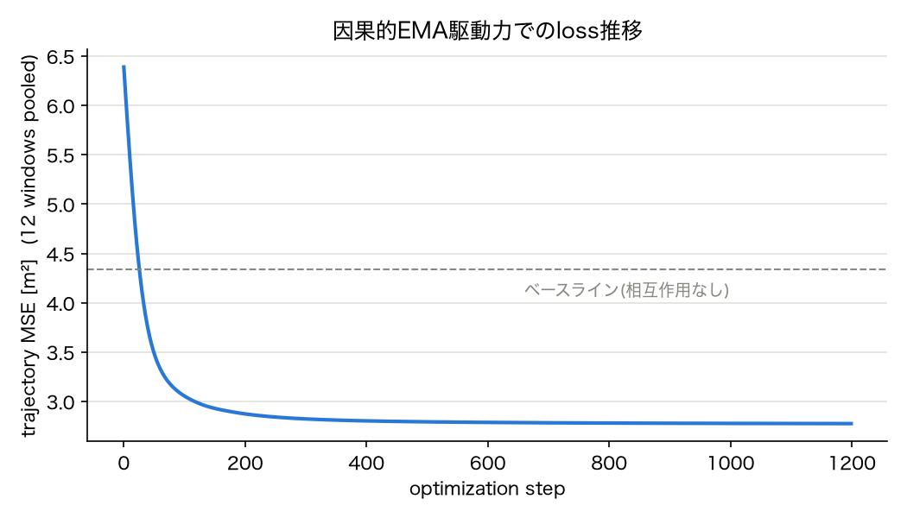

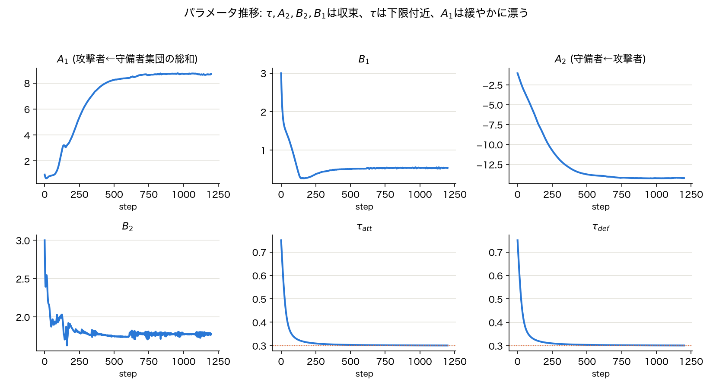

外部情報固定版(追試3, RMSE 5.4m)と比べて絶対誤差は大きく改善したが、自己参照版(追試2, RMSE 0.79m)ほどではない。これは狙い通りで、「リークによる異常な良さ」と「単純化しすぎによる悪さ」の中間に位置している。

パラメータの収束は明確に改善した:

- **$A_1, B_1, A_2, B_2$はいずれも1200ステップまでにほぼ横ばいに収束**($A_1\approx+8.7$, $B_1\approx0.53$, $A_2\approx-14.2$, $B_2\approx1.78$)。追試2(自己参照版プール)で唯一未収束だった$A_1, B_1$も、今回は明確なプラトーに達している。
- **$A_2$の符号は負(引力的)に収束した。** これは追試2(自己参照版、符号は正)とも追試3(外部固定版、収束せず発散)とも異なり、当初の仮説(3.3節・4.1節: 守備者は攻撃者に対して引力的)と整合する結果になった。
- ただし**$\tau_{att}, \tau_{def}$はともに制約の下限(0.3秒)に張り付いている**。これは追試1(制約なし単一局面)で$\tau$が0.03秒まで下がり続けた挙動の再来であり、「もっと下げたいが制約で止められている」状態と考えられる。EMAの半減期0.3秒という設定自体が、$\tau$が短くなりたがる方向にバイアスをかけている可能性がある(EMAの遅れが小さいほど、駆動力だけで軌道をほぼ再現できてしまうため)。

### 解釈

因果的EMA設計は、外部固定設計より大幅に現実的な軌道再現を実現しつつ、$A_1, B_1$の識別性も改善するという、狙った効果の多くを達成した。**ただし$\tau$が依然として下限に張り付いており、EMAの半減期という新しいハイパーパラメータ自体が結果を左右する要因になっている。** 半減期を今より長くすれば(=よりゆっくり追従する意図信号にすれば)、$\tau$が制約の内側で自然に収束する可能性がある。逆に短すぎる半減期は、自己参照版に近い「答えに近い信号」に戻ってしまうリスクがある。

## 追試5: EMA半減期の感度分析

追試4で$\tau$が制約下限(0.3秒)に張り付いた原因が、EMA半減期(0.3秒)自体の短さにあるという仮説を検証するため、半減期を0.3, 0.5, 0.8, 1.2, 2.0秒の5段階で振って同じ12局面プール推定を実行した(`scripts/ema_halflife_sweep.py`、`real_data_pooled_fit_v3.py`を`run_experiment()`として再利用可能な形にリファクタリング)。

### 結果: 仮説は支持されなかった

| 半減期[s] | RMSE[m] | 改善率[%] | $A_1$ | $B_1$ | $A_2$ | $B_2$ | $\tau_{att}$ | $\tau_{def}$ |
|---|---|---|---|---|---|---|---|---|
| 0.30 | 1.67 | 36.1 | +8.70 | 0.54 | −14.22 | 1.77 | 0.301 | 0.301 |
| 0.50 | 2.18 | 30.1 | +18.14 | 1.21 | −32.48 | 1.90 | 0.301 | 0.301 |
| 0.80 | 2.86 | 22.0 | +20.54 | 0.70 | −16.44 | 2.59 | 0.301 | 0.301 |
| 1.20 | 3.51 | 17.7 | +28.24 | 1.07 | −24.64 | 2.63 | 0.301 | 0.301 |
| 2.00 | 4.41 | 11.6 | +13.06 | 1.73 | −1.11 | 13166.78 | 0.301 | 0.301 |

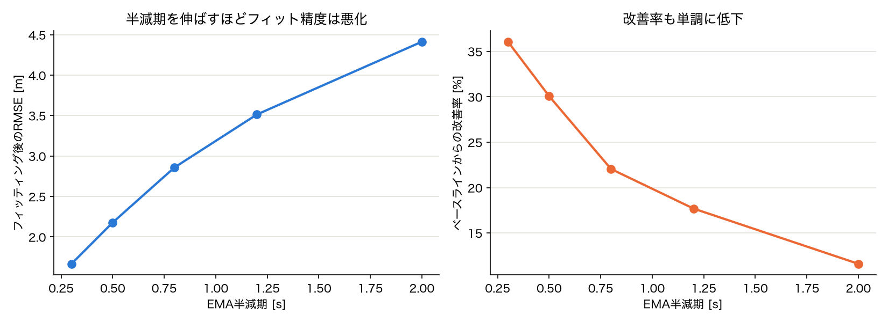

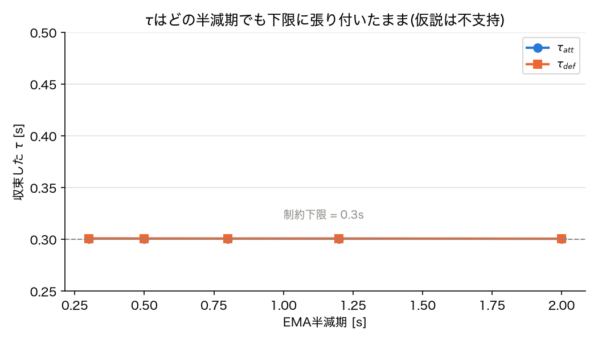

**$\tau_{att}, \tau_{def}$は試した5段階すべてで下限0.3秒に張り付いたまま、微動だにしなかった。** 半減期を0.3秒から2.0秒まで6倍以上に伸ばしても、$\tau$が制約の内側に入る気配は一切ない。

一方で、半減期を伸ばすほど**フィット精度は単調に悪化**した(RMSE 1.67m→4.41m、改善率36.1%→11.6%)。さらに半減期2.0秒では$B_2$が13,167mという明らかに非物理的な値まで発散しており、これは追試1で見た「τを塞ぐと別の自由度(B)が逃げ道になる」現象の再来である。

### 解釈: 「τが小さい」のはEMA半減期のせいではなく、より本質的な理由がある

**仮説(EMA半減期が短すぎるから$\tau$が下限に張り付く)は、この実験結果によって否定された。** 半減期をどれだけ伸ばしても$\tau$は下限に張り付き続けたということは、$\tau$を小さくしたがる圧力は、EMAという特定の駆動力設計の副作用ではなく、**この最適化問題により本質的な要因**に由来すると考えられる。

考えられる本質的な要因は2つある:

1. **実際のサッカー選手の加減速は、歩行者(τ~0.5秒)よりずっと機敏である可能性**: 基本統計量(`phase1_data_pipeline.md`)で見た通り、選手の速さはp99で6.5m/sに達する。エリートアスリートの反応・加減速の速さを踏まえると、$\tau$の「真の値」が歩行者分野の値よりずっと小さいこと自体は、物理的にありえない話ではない。
2. **駆動力(速度追従型)という定式化自体が、この局面群の動きの複雑さに対して力不足である可能性**: 半減期を伸ばすほどフィットが悪化したことは、「駆動力の目標をどう作るか」よりも「駆動力+相互作用力という枠組み全体」が、選手の複雑な意思決定(パス、フェイント、減速)を捉えきれていないことを示唆する。この場合、$\tau$を小さくして相互作用項に説明を肩代わりさせるのは、モデルの表現力不足を補うための合理的な適応、とも解釈できる。

いずれにせよ、**$\tau$の値を「歩行者の0.5秒に近づけること」自体を目標にするのは筋が違う**ということが、この実験からの一番の教訓である。$\tau$が制約の下限に張り付くこと自体が問題なのではなく、それが「モデルが説明しきれない残差を無理やり$\tau$で埋めている」結果なのか、「サッカー選手の$\tau$は本当にこの程度小さい」だけなのかを、別の角度から検証する必要がある。

## 追試6: τの下限制約自体を緩める

追試5で「$\tau$が小さい」ことがEMA半減期の副作用ではないと分かったことを受け、$\tau$が有限の値に真に収束するのか、それとも制約がある限り際限なく小さい方へ向かい続けるのかを切り分けるため、$\tau$の下限を0.3, 0.15, 0.05, 0.01秒の4段階に緩めて同じプール推定を実行した(`scripts/tau_floor_sweep.py`、`real_data_pooled_fit_v3.py::run_experiment()`に`tau_min`引数を追加)。半減期は追試4-5で最もフィットが良かった0.3秒に固定。

### 結果: τは常に「今設定できる最小値」に張り付き続けた

| $\tau$下限[s] | RMSE[m] | 改善率[%] | $A_1$ | $B_1$ | $A_2$ | $B_2$ | 収束した$\tau$ |
|---|---|---|---|---|---|---|---|
| 0.300 | 1.67 | 36.1 | +8.70 | 0.54 | −14.22 | 1.77 | 0.301(下限) |
| 0.150 | 1.35 | 58.2 | +7.73 | 0.03 | −15.79 | 0.50 | 0.151(下限) |
| 0.050 | 1.12 | 71.2 | +11.48 | 0.84 | −9.34 | 0.54 | 0.051(下限) |
| 0.010 | 1.02 | 75.9 | +7.30 | 1.20 | −5.41 | 0.58 | 0.011(下限) |

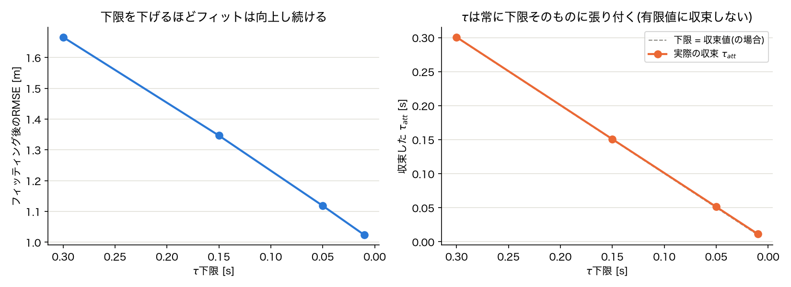

右図は「下限=収束値」の対角線と、実際の収束$\tau_{att}$がぴったり重なっていることを示している。**$\tau$は一度も下限の内側で止まらず、常に「今その時点で許されている最小値」を選び続けた。** さらに下限を下げるほどフィット精度も単調に改善し続けている(改善率36%→76%)。

$A_1, B_1, A_2, B_2$の値は下限設定ごとに大きくばらついており(例: $B_1$は0.03〜1.20の範囲で変動)、一貫した収束値を持っているとは言い難い。

### 解釈: 「選手が機敏だから」ではなく、モデルが縮退している

もし$\tau$に有限の「真の値」(例えば選手の俊敏さを反映した0.1秒程度の値)が存在するなら、下限を0.05秒や0.01秒まで下げても、$\tau$はその真の値の近くで止まるはずである。**実際にはそうならず、下限をどれだけ緩めても常に下限そのものに張り付き続けた。** これは$\tau\to0$がこのモデル・このデータにとっての(局所的な)最適解であることを強く示唆している。

$\tau\to0$の極限では、駆動力はほぼ瞬時にEMA速度(過去の自分の動きの延長)へスナップする。それでもフィットが良くなり続けるということは、**このモデルにとって、相互作用力$A,B$を使って説明するよりも「駆動力に答えを丸投げする」ことの方が常に低コストな解決策になっている**ということであり、追試1(単一局面、制約なし)で見た$\tau$の発散と本質的に同じ病理が、プール推定・因果的EMA設計でも解消されていなかったことになる。

これは「サッカー選手は歩行者より加減速が機敏だから$\tau$が小さい」という物理的な解釈(直感的には自然な仮説)を**支持しない**。むしろ、EMAという駆動力信号自体が(未来を見ないとはいえ)まだ選手の直近の動きに十分近く、$\tau$を極端に小さくすることで実質的に「答えの延長線上をなぞる」近道が常に残っている、というモデル設計上の構造的な問題を示していると考えられる。

## 追試7: τを固定し、A,Bだけの説明力を直接テストする

追試6までで、$\tau$を自由パラメータにすると常に「その時点で許される最小値」に張り付き続けることが分かった。これが本当に「駆動力への丸投げ」なのかを確定させるため、$\tau$を**最適化対象から外して固定値**にし、相互作用項$A_1,B_1,A_2,B_2$だけがベースライン(相互作用なし、同じ固定$\tau$)からどれだけ改善できるかを直接テストした(`scripts/tau_fixed_ab_only.py`)。駆動力設計(EMA半減期0.3秒)は追試4-6と同一。$\tau$を0.1, 0.3, 0.5, 0.8, 1.2秒の5段階で固定し、それぞれ1200ステップ最適化。

### 結果: A,Bだけの改善効果はごくわずか

| $\tau$固定[s] | ベースラインRMSE[m] | フィット後RMSE[m] | 改善率[%] |
|---|---|---|---|
| 0.10 | 1.234 | 1.232 | 0.3 |
| 0.30 | 1.681 | 1.654 | 3.1 |
| 0.50 | 2.084 | 2.041 | 4.1 |
| 0.80 | 2.612 | 2.526 | 6.4 |
| 1.20 | 3.188 | 3.069 | 7.3 |

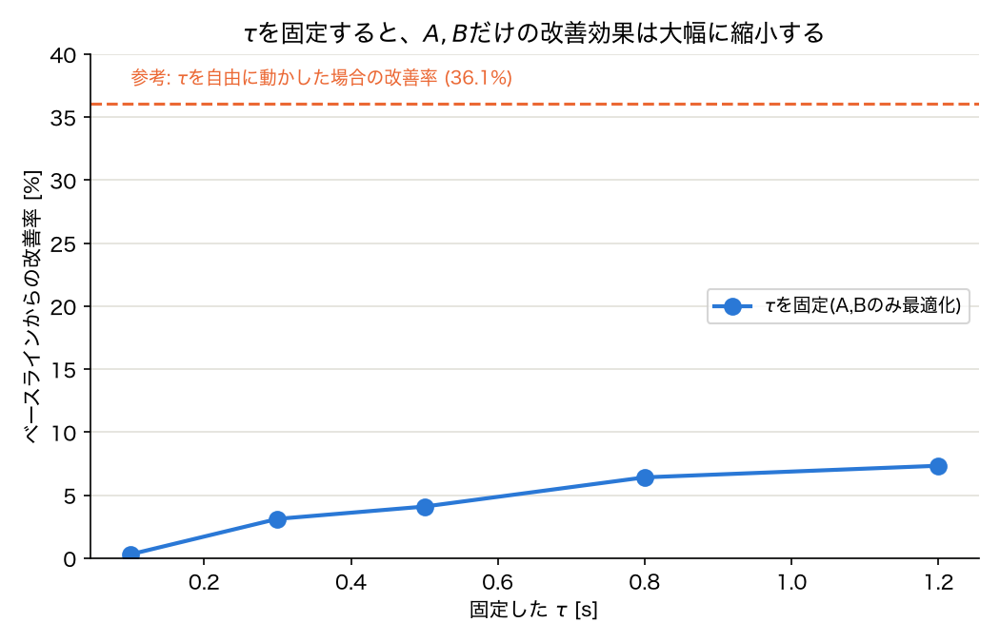

**$\tau$を固定した場合の改善率(最大でも7.3%)は、$\tau$を自由に動かせた場合の改善率(追試4, 36.1%)に遠く及ばない。** つまり、これまでの実験で見てきた「良いフィット」のほとんどは、$\tau$が自由に縮んで駆動力に軌道を丸投げできることに由来しており、相互作用項$A, B$自体が担っていた説明力はごくわずかだった、ということが直接的に示された。

$\tau$を大きくするほど(駆動力の効きが弱くなるほど)改善率がわずかに増える傾向(0.3%→7.3%)は見られるが、それでも頭打ちの水準は低い。

### 解釈: 結論が出た

これは追試2〜6を通じて疑ってきたことへの、最も直接的で厳しい答えである。**現在の相互作用項の定式化(3.3節、指数関数的な力を役割クラスごとにプールする設計)は、少なくともこのデータ・この局面群において、駆動力なしでは軌道をほとんど説明できない。** これまでの「$A_2$の符号が仮説と整合した」「$B_2$が実データの距離分布と近い値を取った」といった良い兆候(追試2, 4)は、これらの値自体が誤りというわけではないが、**その推定が軌道全体の誤差のごく一部にしか基づいていない**ため、解釈にはこれまで考えていた以上に慎重になる必要がある。

これは駆動力側の設計(EMA半減期など)をこれ以上調整しても解決しない問題であり、前回検討していた「駆動力信号の独立性をさらに高める」方向の優先度は下がる。むしろ、**相互作用項の定式化自体(指数関数の形、役割クラスの分け方、あるいは今回想定している「攻撃者1人+守備者集団」という単純化された系そのもの)を見直す必要がある**、というのがここまでの一連の実験全体からの結論である。

## 追試8: 近接局面への絞り込みによる改善率の再集計

追試7の全フレーム平均の改善率(最大7.3%)は、守備者から離れていて指数関数的な相互作用力がほぼゼロに近い局面を大量に含んでおり、それが平均を薄めている可能性がある。この懸念を検証するため、追試7で既に推定済みの$A,B$(再最適化はせず再利用)を使い、フレームごとの誤差改善を「その瞬間の最近傍守備者との観測距離」でビン分けして再集計した(`scripts/distance_stratified_analysis.py`、追加の最適化なしで軽量に実行可能)。距離ビン: 0-2, 2-4, 4-6, 6-10, 10-15, 15-25m。

### 結果: 「薄まり」は部分的に確認されたが、単純な話ではなかった

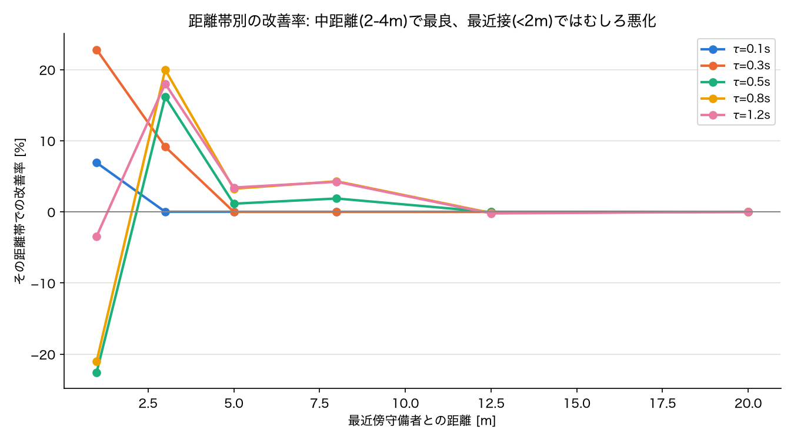

| 距離帯 | $\tau$=0.1s | $\tau$=0.3s | $\tau$=0.5s | $\tau$=0.8s | $\tau$=1.2s |
|---|---|---|---|---|---|
| 0-2m | +6.9% | +22.8% | **−22.6%** | **−21.0%** | −3.4% |
| 2-4m | 0.0% | +9.1% | +16.2% | +20.0% | +18.0% |
| 4-6m | 0.0% | 0.0% | +1.1% | +3.2% | +3.4% |
| 6-10m | 0.0% | 0.0% | +1.9% | +4.3% | +4.2% |
| 10m以上 | ~0% | ~0% | ~0% | ~0% | ~0% |

10m以上の遠距離ではどの$\tau$でも改善率はほぼゼロであり、**追試7の全体平均(7.3%など)が遠距離フレームによって大きく薄められていたこと自体は確認された**($\tau$=0.3sの全体平均3.1%に対し、2-4m帯では9.1%、0-2m帯では22.8%まで上がる)。

しかし単純に「近づくほど改善する」という単調な関係にはなっておらず、**$\tau$=0.5秒以上では、最も近い距離帯(0-2m)でむしろベースラインより悪化している**(−21%〜−23%)。改善が最も大きいのは0-2mではなく2-4m帯であり、そこから離れるにつれて緩やかに効果が減衰する、という山型のパターンになっている。

### 解釈: 「薄まり」仮説は部分的に正しいが、新たな懸念(最近接での悪化)が浮上した

近接局面(2-6m程度)には確かに相互作用項が捉えている本物のシグナルがあると考えられる。$\tau$を大きくする(駆動力を弱める)ほど2-4m帯の改善率が伸びている(+9%→+20%)ことは、この距離帯で$A,B$が意味のある仕事をしていることを支持する。

一方、**最も距離が近い(0-2m)局面、すなわち研究の核心である「強い守備プレッシャー」局面そのもので、$\tau\geq0.5$秒では相互作用項を加えることでかえって軌道再現が悪化している**のは看過できない。考えられる原因:

- 0-2m帯のフレーム数(156)は2-4m帯(372)よりかなり少なく、MSEを最小化する最適化が、フレーム数の多い2-4m帯に有利なパラメータへ引っ張られている(0-2m帯を多少犠牲にしてでも2-4m帯を合わせた方が全体の損失は下がる)
- 指数関数的な力の形が、極端に近い距離では過大な力を生み出し、実際の選手の動き(密着マークでの微妙な間合いの取り方)をオーバーシュートしている可能性

研究計画7節で想定している「プレッシャー指標$P_i(t)$」は、まさにこの最近接局面での挙動が最も重要になる部分であるため、この悪化は軽視できない。**近接局面でのフィット改善という当初の期待(仮説②寄り)は部分的に支持されたが、同時に「最も重要な局面でモデルが機能していない」という、①(定式化の問題)に近い新たな懸念が生まれた。**

## 未解決・次のアクション

- [x] ~~τに対する正則化・妥当な範囲の制約~~ → 実施済み。単独では不十分と判明(Bが代わりに発散)。
- [x] ~~複数区間でのプールされたフィッティング~~ → 実施済み。自己参照版では$A_2, B_2, \tau$は収束、$A_1, B_1$には識別性の課題が残ることを確認。
- [x] ~~$v_0 e_i(t)$の外部情報ベースへの再設計~~ → 実施済み。リークは排除できたが、駆動力の近似(一定速度直進)が単純化しすぎており、フィット精度・収束性ともに悪化。
- [x] ~~駆動力設計の中間案(因果的EMA)の検討~~ → 実施済み。$A_1,B_1,A_2,B_2$は収束、$A_2$の符号も仮説と整合。ただし$\tau$が下限に張り付く問題が残る。
- [x] ~~EMA半減期の感度分析~~ → 実施済み。仮説は否定された。半減期を伸ばすほどフィットは単調に悪化し、τは常に下限に張り付いたまま。τの縮退はEMA設計の副作用ではなく、より本質的な要因(選手の機敏さ、またはモデルの表現力不足)による可能性が高い。
- [x] ~~τの下限制約自体を緩めた実験~~ → 実施済み。τは常に「その時点の下限そのもの」に張り付き続け、有限値には収束しなかった。「選手が機敏だから」ではなく、駆動力への丸投げ(モデルの縮退)が起きていると判断。
- [x] ~~駆動力自体を極端に弱くする・切る実験~~ → 実施済み。τを固定すると$A,B$だけの改善効果は0.3〜7.3%に留まり、τが自由な場合の改善率36.1%に遠く及ばない。**これまでの良いフィットの大部分はτの縮退(駆動力への丸投げ)によるものであり、現在の相互作用項の定式化には軌道を説明する実質的な力がほとんどないことが直接示された。**
- [x] ~~近接局面への絞り込みによる改善率の再集計~~ → 実施済み。遠距離では改善率ほぼゼロで「薄まり」仮説を支持。ただし2-4m帯で最良、0-2m(最も重要な密着局面)ではτ≥0.5秒でむしろ悪化するという新たな懸念が判明。
- [ ] **合成データでのτ固定リカバリーテスト(最優先)**: 既知の$A_{true}, B_{true}, \tau_{true}$でSFMのODEを積分して合成軌道を作り、$\tau$を真値に**固定**した上で$A,B$のみを推定できるかを確認する(`synthetic_recovery_test.py`は$\tau$も自由推定だったため、実データの追試7と条件を揃えた再検証が必要)。これが失敗すれば定式化・識別可能性自体の問題が濃厚、成功すれば実データの粗さ・駆動力信号の設計が原因である可能性が高まる。
- [ ] **最近接局面(0-2m)での悪化の原因調査**: フレーム数の不均衡(0-2m帯156フレーム vs 2-4m帯372フレーム)による損失の偏り、または指数関数的な力が極端に近い距離で過大になる(オーバーシュート)可能性を切り分ける。距離帯ごとに重み付けを変えた損失関数での再フィット、あるいは力の関数形自体(指数関数以外)の検討が必要になる可能性がある。
- [ ] **味方協調力(4.4節)の追加**: 「攻撃者1人+守備者集団」という単純化が、味方選手からの影響(横山論文のcooperative force)を無視していることによる誤差混入の可能性。上記2点の結果を見てから着手を判断する。
- [ ] **相互作用項の定式化そのものの見直し**: 上記の診断実験の結果次第で、指数関数的な力の形、役割クラスの分け方を再検討する。ユーザー提案のピッチコントロールに基づくポテンシャル場$e_i(t)=\nabla\Phi_i/\|\nabla\Phi_i\|$は、駆動力の再設計だけでなく相互作用項側の再設計のヒントとしても再検討する価値がある。
- [ ] $A_2$の符号(負=引力的)は、今回の結果を踏まえると、軌道再現全体への寄与が小さい中での推定値であり、解釈には強い留保が必要。7.2節の検証(既存指標との照合)は定式化の見直し後に行う。

## 関連ファイル

- `scripts/real_data_fit_test.py` — 区間選定・フィッティング本体(τ制約なし、単一局面、自己参照版)
- `scripts/real_data_fit_result.json` — 実行結果(τ制約なし)
- `scripts/plot_real_data_fit.py` — 図の生成スクリプト(τ制約なし)
- `scripts/real_data_fit_tau_constrained.py` — τ制約ありの追試(単一局面、自己参照版)
- `scripts/real_data_fit_tau_constrained_result.json` — 実行結果(τ制約あり)
- `scripts/plot_real_data_fit_tau_constrained.py` — 図の生成スクリプト(τ制約あり)
- `scripts/real_data_pooled_fit.py` — 12局面プール推定(自己参照版)
- `scripts/real_data_pooled_fit_result.json` — 実行結果(プール推定・自己参照版)
- `scripts/plot_real_data_pooled_fit.py` — 図の生成スクリプト(プール推定・自己参照版)
- `scripts/real_data_pooled_fit_v2.py` — 12局面プール推定(外部情報ベース版)
- `scripts/real_data_pooled_fit_v2_result.json` — 実行結果(外部情報ベース版)
- `scripts/plot_real_data_pooled_fit_v2.py` — 図の生成スクリプト(外部情報ベース版)
- `sfm_press/data.py::determine_attacking_goal_x()` — GK位置から攻撃方向を判定する関数(外部情報ベース版で使用)
- `scripts/real_data_pooled_fit_v3.py` — 12局面プール推定(因果的EMA版、`run_experiment()`として再利用可能な形にリファクタリング済み)
- `scripts/real_data_pooled_fit_v3_result.json` — 実行結果(因果的EMA版、半減期0.3秒)
- `scripts/plot_real_data_pooled_fit_v3.py` — 図の生成スクリプト(因果的EMA版)
- `scripts/ema_halflife_sweep.py` — EMA半減期の感度分析(5段階スイープ)
- `scripts/ema_halflife_sweep_result.json` — 実行結果(半減期スイープ)
- `scripts/plot_ema_halflife_sweep.py` — 図の生成スクリプト(半減期スイープ)
- `scripts/tau_floor_sweep.py` — τ下限の感度分析(4段階スイープ)
- `scripts/tau_floor_sweep_result.json` — 実行結果(τ下限スイープ)
- `scripts/plot_tau_floor_sweep.py` — 図の生成スクリプト(τ下限スイープ)
- `documents/figures/real_fit_trajectories.png`, `real_fit_loss.png`, `real_fit_tau.png` — τ制約なし(単一局面)の画像
- `documents/figures/real_fit_tau_constrained_trajectories.png`, `real_fit_tau_constrained_params.png` — τ制約あり(単一局面)の画像
- `documents/figures/real_pooled_fit_loss.png`, `real_pooled_fit_params.png` — プール推定(自己参照版)の画像
- `documents/figures/real_pooled_fit_v2_loss.png`, `real_pooled_fit_v2_params.png` — プール推定(外部情報ベース版)の画像
- `documents/figures/real_pooled_fit_v3_loss.png`, `real_pooled_fit_v3_params.png` — プール推定(因果的EMA版)の画像
- `documents/figures/ema_halflife_sweep_fit.png`, `ema_halflife_sweep_tau.png` — 半減期スイープの画像
- `documents/figures/tau_floor_sweep.png` — τ下限スイープの画像
- `scripts/tau_fixed_ab_only.py` — τ固定・A,Bのみ最適化する説明力テスト(5段階)
- `scripts/tau_fixed_ab_only_result.json` — 実行結果(τ固定テスト)
- `scripts/plot_tau_fixed_ab_only.py` — 図の生成スクリプト(τ固定テスト)
- `documents/figures/tau_fixed_ab_only.png` — τ固定テストの画像
- `scripts/distance_stratified_analysis.py` — 距離帯別の改善率再集計(追加最適化なし)
- `scripts/distance_stratified_result.json` — 実行結果(距離帯別再集計)
- `scripts/plot_distance_stratified.py` — 図の生成スクリプト(距離帯別再集計)
- `documents/figures/distance_stratified.png` — 距離帯別再集計の画像
