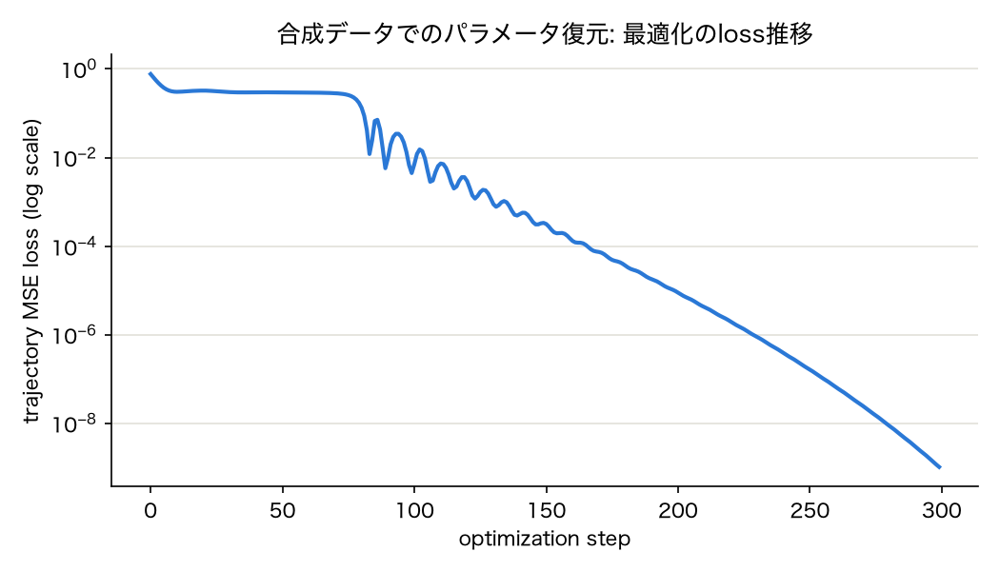
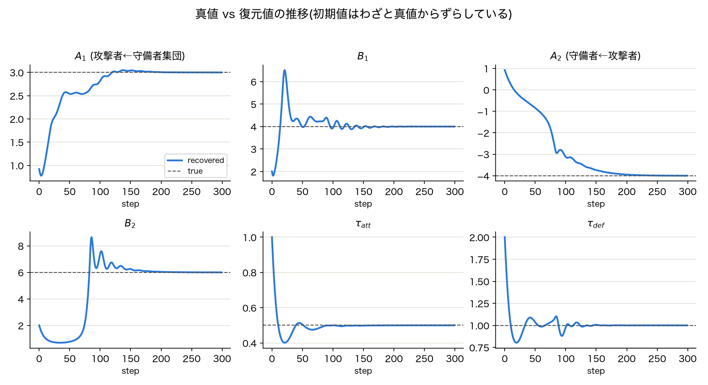

# 事前検証: 合成データによるSFMパラメータ回復性テスト

`check_distance_range.md` の次のステップとして実施した、(B)軌道ベース最適化(research_plan.md 5.2節)の実行可能性チェックの記録。

## 目的

3.3節の相互作用項は複数の相手選手からの力を総和する形($\sum_{j \in Opp(i)} \vec{f}_{ij}$)を取る。実際に観測できるのは加速度、つまり**複数選手からの力の総和**のみであるため、個々のペアの$A_{ij}, B_{ij}$を分離して推定できるかどうかは自明ではない(多選手の重ね合わせによる非識別性、`check_distance_range.md`で触れた懸念の2点目)。

これを確認するため、既知のパラメータでSFMのODEを積分して合成軌道を生成し、(B)の軌道ベース最適化がその真のパラメータを復元できるかをテストした。**モデルの定式化が観測データと完全に一致し、ノイズも存在しない理想条件**での検証である点に注意。

## 方法

最小構成のシミュレーション(`scripts/synthetic_recovery_test.py`):

- **攻撃者(ボール保持者)1人 + 守備者3人**、20エピソード(初期配置をランダムに変えたシナリオ)
- 攻撃者: 前進方向(+x)への駆動力($\tau_{att}$)を持ち、**守備者3人からの力を総和**で受ける($A_1, B_1$)
- 守備者: 自陣方向への弱い駆動力($\tau_{def}$)を持ちつつ、攻撃者からの力を受ける($A_2, B_2$)
- 真のパラメータとして $A_2 < 0$(攻撃者に対して引力的 = チェイスする挙動)を設定
- torchdiffeq(RK4, 25Hz相当)でODEを積分して合成軌道(ノイズなし)を生成
- 推定パラメータ($A_1, B_1, A_2, B_2, \tau_{att}, \tau_{def}$)は**真値から意図的にずらした初期値**からスタートし、特に$A_2$は符号も逆(正)から開始
- Adamで軌道の二乗誤差(観測軌道との位置誤差)を最小化(300ステップ)

合成データの距離レンジ(攻撃者〜各守備者): min 0.16m 〜 max 60.73m、中央値21.83m — 実データで確認した分布(`check_distance_range.md`: 0.13〜42m、中央値4.75m)と近いオーダー。

## 結果

### Loss推移

300ステップでlossは0.76(初期)から約$10^{-9}$まで単調に低下。80〜120ステップ付近で振動が見られるが、これは後述の$A_2$の符号反転が起きている区間と一致する。

### パラメータの収束

| パラメータ | 真値 | 復元値 | 相対誤差 | 符号 |
|---|---|---|---|---|
| $A_1$(攻撃者←守備者集団) | +3.000 | +3.000 | 0.0% | OK |
| $B_1$ | +4.000 | +4.000 | 0.0% | OK |
| $A_2$(守備者←攻撃者) | **−4.000** | **−3.999** | 0.0% | OK |
| $B_2$ | +6.000 | +6.000 | 0.0% | OK |
| $\tau_{att}$ | 0.500 | 0.500 | 0.0% | OK |
| $\tau_{def}$ | 1.000 | 1.000 | 0.0% | OK |

**$A_2$は正の初期値(+0.92)から出発し、最適化の過程で正しく負に符号反転して真値に収束している。** これは、守備側の相互作用係数の符号を事前に固定せずデータから推定する(3.3節の設計方針)というアプローチが、少なくとも数理的には機能し得ることを示す結果である。

## 解釈

- **多選手の重ね合わせ(3人の守備者からの力の総和)がある状態でも、(B)の最適化は6つのパラメータすべてを高精度に復元できた。** 前回の懸念(`check_distance_range.md`)で最も深刻とみなしていたリスクは、少なくともこの理想条件下では顕在化しなかった。
- 符号を反転させた初期値からでも正しい符号に収束した点は、最適化ランドスケープが(このシナリオ・この初期値では)大域的に妥当な形をしていることを示唆する。

## 未解決・次のアクション

- [ ] **ノイズを加えたロバスト性テスト**: 実データにはトラッキングノイズが乗る。位置に小さなガウスノイズを加えた場合の復元精度を確認する。
- [ ] **複数の初期値からの収束確認**: 今回は1つの初期値のみ。局所解に陥るケースがないか、ランダムな初期値を複数試す。
- [ ] **距離レンジを絞ったケース**: 実データの「密着プレッシャー局面のみ」を模した狭い距離レンジで同様のテストを行い、識別可能性が本当に距離の多様性に依存するかを確認する。
- [ ] 本テストは理想条件(モデルとデータ生成過程が完全一致)での検証に過ぎない。実データでの軌道再現性・係数の妥当性は別途7節の検証計画で確認する必要がある。

## 関連ファイル

- `scripts/synthetic_recovery_test.py` — シミュレーション・最適化本体
- `scripts/synthetic_recovery_result.json` — 実行結果(全ステップの履歴を含む生データ)
- `scripts/plot_synthetic_recovery.py` — 図の生成スクリプト
- `documents/figures/synthetic_recovery_loss.png`, `documents/figures/synthetic_recovery_params.png` — 本ドキュメントに埋め込んだ画像
